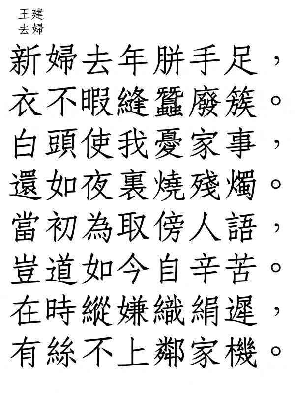

.. chess-bead documentation master file, created by
   sphinx-quickstart on Tue Jun 29 01:47:20 2021.
   You can adapt this file completely to your liking, but it should at least
   contain the root `toctree` directive.

Welcome to chess-bead's documentation!
======================================

Description
----------------

Package for the both chess and Chinese poetry game. The rules of the game involve chess moves from games in pgn format. The board for the game is a Chinese poem of the Tang era, in which the line is equal to 7 characters (the last, 8th vertical is most often punctuation marks). When a piece makes a move, the characters on the board change places. The character on which the piece was is moved to the place of the character to which the move was made.

    

You can get the result texts and visualize it with the package.

You can use custom game in PGN format. 

Inspired by Das Glasperlenspiel by Hermann Hesse.

Quick start
----------------

.. code:: python

    import chess_bead as cb
    
    g = cb.Game()                       # use random chess game from the example PGN 
                                        # file included in the package
    verses = g.start_game()             # get all the permutations in the poem
    v = cb.Viz(verses, g.author, g.title)    # prepare visualization
    v.gif()                             # make the GIF animation with the name 
                                        #'game.gif' in the working directory
    del v                               # clean up the tmp dir

Installation
----------------

The tool could be installed with pip

::

    pip3 install chess_bead

External resources
--------------------
 
* The poems are taken from the collection `selected from this repository <https://github.com/snowtraces/poetry-source>`_.
* The package uses cwTeXFangSong font licensed with SIL Open Font License (Version 1.1), `see <https://github.com/l10n-tw/cwtex-q-fonts>`_ 
* `Compiled TTFs <https://github.com/l10n-tw/cwtex-q-fonts-TTFs>`_ 

.. toctree::
   :maxdepth: 2
   :caption: Contents:

Indices and tables
==================

* :ref:`genindex`
* :ref:`modindex`
* :ref:`search`
